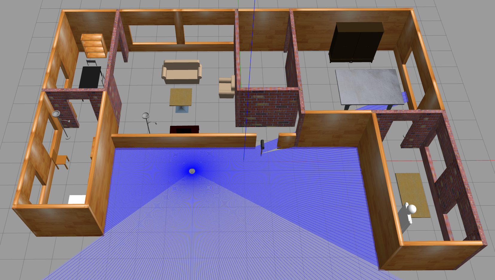
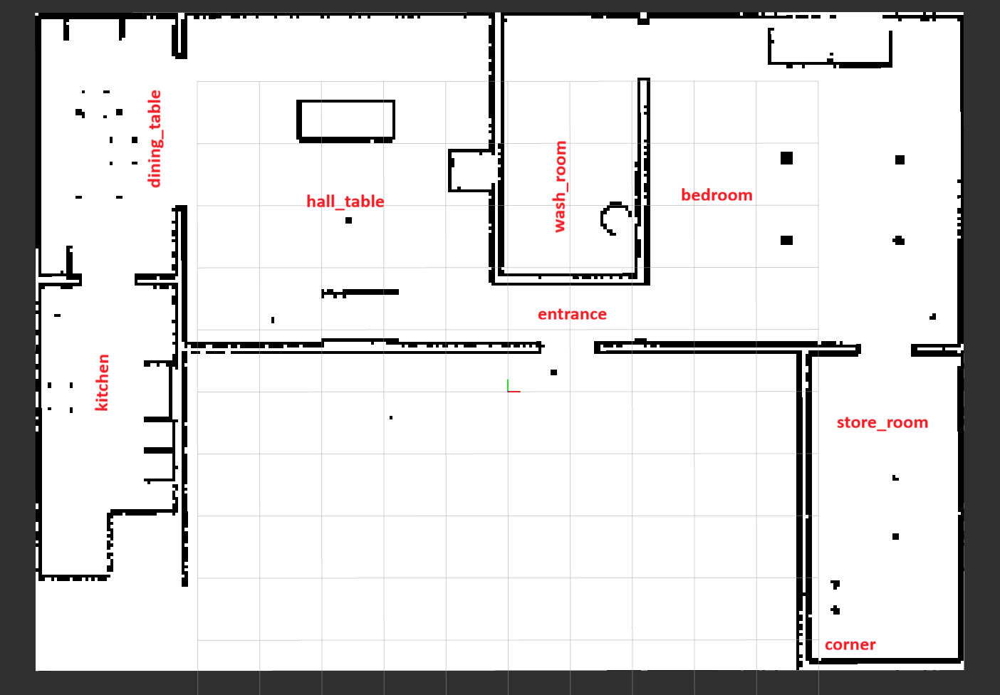
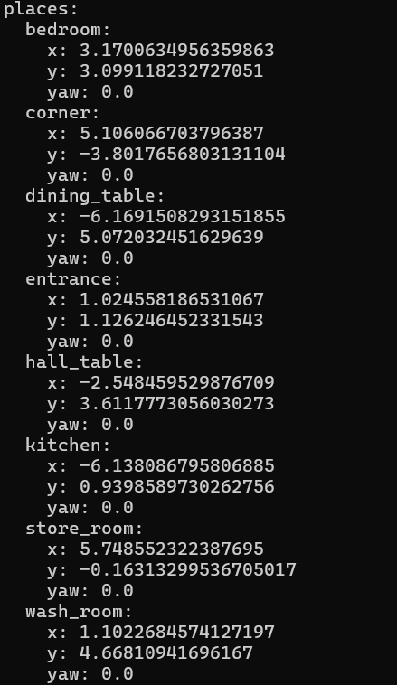

# Semantic Indoor Navigation in a Home Environment using ROS 2, Nav2, and Gazebo

A ROS 2 Humble + Nav2 + Gazebo project where a TurtleBot navigates to **named semantic places** such as `entrance`, `hall_table`, and `wash_room` inside a **semi-custom home environment**.  

The system converts named places into target poses, generates ranked candidate approach poses, and executes navigation through Nav2 with fallback behavior for constrained indoor spaces such as entrances, corners, and narrow passages.

---

## Demo

**Video demo:** https://youtu.be/xDv3p-Wttoc

The demo shows:
- the semi-custom Gazebo home environment
- the generated occupancy map
- named place definitions
- semantic target selection
- ranked candidate approach poses
- successful navigation through multiple home locations

---

## Project Overview

This project demonstrates a semantic indoor navigation pipeline in simulation.  
Instead of navigating to arbitrary XY coordinates, the robot can be sent to **named places** inside a custom mapped home environment.

The project combines:
- a semi-custom Gazebo world
- a saved 2D occupancy map
- named semantic locations
- candidate approach-pose ranking
- Nav2-based path planning and execution

---

## Key Features

- Custom semi-realistic home environment built in Gazebo
- Saved occupancy-grid map generated with SLAM
- Navigation to semantic destinations such as:
  - `entrance`
  - `hall_table`
  - `dining_table`
  - `kitchen`
  - `store_room`
  - `bedroom`
  - `wash_room`
  - `corner`
- Ranked candidate approach poses around the target
- Fallback candidate handling for constrained spaces
- RViz integration for visualization and testing
- Modular ROS 2 package structure

---

## System Architecture

```text
/go_to_place (String command)
        ↓
go_to_named_place_node
        ↓
/semantic_target_pose
        ↓
approach_pose_generator
        ↓
/ranked_approach_poses
        ↓
nav_executor
        ↓
Nav2 NavigateToPose
        ↓
Robot motion in custom home world
```

### Core Packages

#### `semantic_nav_perception`
Handles target input and named-place management:
- saving named places from RViz clicked points
- loading named places from YAML
- converting named commands into target poses

#### `semantic_nav_planning`
Generates and ranks candidate approach poses:
- creates candidate standoff poses around a target
- filters poses based on occupancy and clearance
- ranks feasible candidates

#### `semantic_nav_execution`
Executes ranked goals:
- subscribes to ranked candidate poses
- sends the best candidate to Nav2
- falls back to the next candidate if needed

#### `semantic_nav_bringup`
Contains the environment and runtime configuration:
- custom home world
- saved map
- launch files
- planner and named-place configs

#### `semantic_nav_eval`
Used for logging / evaluation.

---

### Environment Views

#### Custom Gazebo Home World


#### Saved Occupancy Map


#### Named Places Configuration


---

## How the Navigation Works

The robot is **not** sent directly to the center of the named place.
The robot is not sent directly to the exact center of the named place.
Instead, the planner generates multiple safe standoff / approach poses slightly offset from the target so the robot can stop at a safer, more feasible position near the destination rather than colliding with nearby walls, furniture, or narrow obstacles.

Instead, the pipeline works like this:

1. A named place command is received.
2. That command is converted into a target pose in the map frame.
3. The planner generates multiple **candidate approach poses** around the target.
4. Invalid poses are filtered out based on occupancy / clearance.
5. The remaining poses are ranked.
6. The best candidate is sent to Nav2.
7. If navigation fails, fallback candidates can be attempted.

This makes the system more robust in indoor spaces where approaching a semantic location directly may be difficult due to walls, doorways, or furniture.

---

## Approach Pose Ranking

Candidate poses are evaluated using factors such as:
- collision / occupancy validity
- clearance around the pose
- relative heading toward the target
- distance from the robot

In practice, most successful runs used the top-ranked candidate, which indicates that the ranking logic was usually able to select a feasible approach pose on the first attempt.

For constrained zones like the entrance and narrow areas, fewer valid candidates were available.

---

## Requirements

- Ubuntu 22.04
- ROS 2 Humble
- Nav2
- Gazebo Classic
- RViz2
- TurtleBot3 simulation packages
- Python 3

---

## Running the Project

### 1. Source ROS and workspace

```bash
source /opt/ros/humble/setup.bash
source ~/semantic_nav_ws/install/setup.bash
```

### 2. Launch the custom home simulation

```bash
export TURTLEBOT3_MODEL=waffle
export LIBGL_ALWAYS_SOFTWARE=1
export GAZEBO_MODEL_PATH=$HOME/.gazebo/models:/opt/ros/$ROS_DISTRO/share/turtlebot3_gazebo/models:$GAZEBO_MODEL_PATH

ros2 launch semantic_nav_bringup medha_home_sim.launch.py
```

In RViz:
- click **Startup**
- set **2D Pose Estimate**

### 3. Launch the semantic navigation stack

```bash
source /opt/ros/humble/setup.bash
source ~/semantic_nav_ws/install/setup.bash
ros2 launch semantic_nav_bringup semantic_nav.launch.py
```

### 4. Send a named-place command

Examples:

```bash
ros2 topic pub --once /go_to_place std_msgs/msg/String "{data: 'entrance'}"
ros2 topic pub --once /go_to_place std_msgs/msg/String "{data: 'hall_table'}"
ros2 topic pub --once /go_to_place std_msgs/msg/String "{data: 'dining_table'}"
ros2 topic pub --once /go_to_place std_msgs/msg/String "{data: 'kitchen'}"
ros2 topic pub --once /go_to_place std_msgs/msg/String "{data: 'bedroom'}"
```

---

## Test Results

A set of **10 manual navigation trials** was conducted across the custom home environment.

### Summary

- **Total trials:** 10
- **Successful trials:** 10 / 10
- **Candidate 1 used:** 9 / 10
- **Candidate 2 used:** 1 / 10
- **Candidate 3 used:** 0 / 10

### Results Table

| Place         | Trial | Used Candidate/3 | Success | Notes |
|--------------|------:|-----------------:|---------|-------|
| entrance     | 1     | 2                | Yes     | Via initial position. Narrow path |
| hall_table   | 2     | 1                | Yes     | Via entrance |
| dining_table | 3     | 1                | Yes     | Via hall_table |
| kitchen      | 4     | 1                | Yes     | Via dining_table |
| store_room   | 5     | 1                | Yes     | Via kitchen. Longest path |
| bedroom      | 6     | 1                | Yes     | Via store_room |
| wash_room    | 7     | 1                | Yes     | Via bedroom. Narrow path |
| entrance     | 8     | 1                | Yes     | Via wash_room |
| corner       | 9     | 1                | Yes     | Via entrance. Corner with obstacle |
| hall_table   | 10    | 1                | Yes     | Via corner |

### Interpretation

The planner selected the top-ranked candidate in most trials, which suggests the candidate-ranking logic was generally effective in this environment.  
A fallback candidate was required in the initial entrance test, where the robot had to pass through a narrower approach region from the starting position.

---

## Limitations

- Named places are manually defined in YAML rather than inferred from perception.
- Some goals work more reliably when approached through intermediate locations such as `entrance`.
- The project currently runs in simulation only.
- Testing was performed manually rather than through a fully automated benchmark pipeline.
